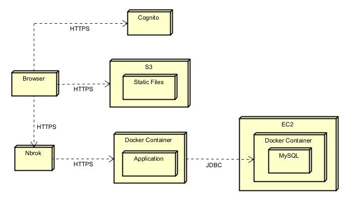
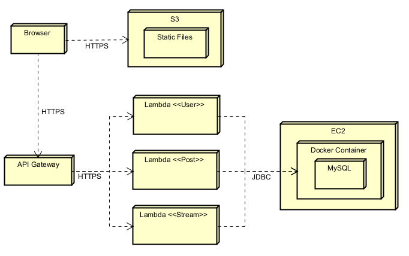
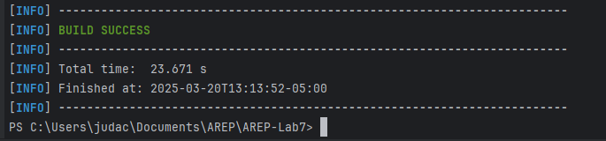
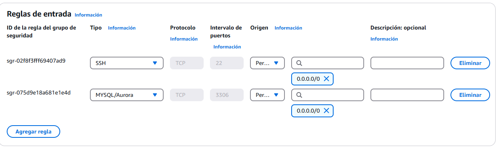
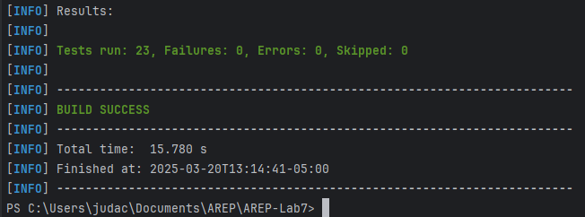

# Taller 7 | AREP

## API From Monolith to Microservices

In this lab, we developed a Twitter-like API that allows users to create and post short messages (up to 140 characters) in a unified stream. The project was initially designed as a monolithic Spring Boot application and later evolved into a microservices-based architecture. The lab was divided into the following key stages:

- Monolithic API Development.
- Frontend Development and Deployment.
- Security Implementation.
- Microservices Architecture.
- Final Deployment and Testing.

The entire application is deployed on AWS. This lab provided hands-on experience in API design, cloud deployment, security integration, and microservices architecture.

## Monolithic Architecture

The following deployment diagram illustrates the architecture of our monolithic system, which consists of a frontend hosted on **AWS S3**, authentication handled by **AWS Cognito**, a backend running inside a **Docker container**, and a **MySQL database on an EC2 instance**.

### **Architecture Components:**

1. **Browser**: The client-side interface where users interact with the application.
2. **S3**: Hosts the static files (HTML, CSS, JS) for the frontend.
3. **Cognito**: Manages user authentication and authorization using JWT.
4. **Nbrok**: A tunneling tool that exposes the local backend to the internet securely via HTTPS.
5. **Backend (Docker Local)**: The Spring Boot application running locally in a Docker container.
6. **EC2 (Database)**: Hosts the MySQL database in a Docker container.

### **Communication Flow:**

- **Browser -> S3**: The browser loads static files (HTML, CSS, JS) from S3.
- **Browser -> Cognito**: The browser authenticates users via Cognito and receives JWT tokens.
- **Browser -> Nbrok**: The browser sends API requests to the backend through the Nbrok tunnel.
- **Nbrok -> Backend**: Nbrok forwards requests to the locally running backend.
- **Backend -> EC2 (Database)**: The backend interacts with the database hosted on EC2 using JDBC.

### **Deployment Diagram:**



This setup ensures a scalable and secure system, allowing user authentication via AWS Cognito, serverless frontend hosting on S3, and a persistent data layer using MySQL on EC2.

## Microservices Architecture

This diagram illustrates the architecture of the application after splitting the monolith into microservices. The components are:

### **Architecture Components:**

1. **Browser**: The client-side interface where users interact with the application.
2. **S3**: Hosts the static files (HTML, CSS, JS) for the frontend.
3. **API Gateway**: Acts as the entry point for HTTP requests and routes them to the appropriate Lambda functions.
4. **Lambda 1, 2, 3**: Three Lambda functions representing the microservices (e.g., `UsuarioService`, `HiloService`, `PostService`).
5. **EC2 (Docker + MySQL)**: Hosts the MySQL database in a Docker container.

### **Communication Flow:**

- **Browser -> S3**: The browser loads static files (HTML, CSS, JS) from S3.
- **Browser -> API Gateway**: The browser sends API requests to the API Gateway.
- **API Gateway -> Lambda 1, 2, 3**: The API Gateway routes requests to the corresponding Lambda functions.
- **Lambda User, Post, Stream -> EC2 (MySQL)**: Each Lambda function interacts with the MySQL database hosted on EC2 using JDBC.

### **Deployment Diagram:**



This architecture ensures scalability and separation of concerns, with each microservice handling a specific functionality.

## Class Design

```
src/main/java
└── co.edu.ecuelaing.arep.microservicios
    ├── config
    │   ├── CognitoLogoutHandler.java
    │   ├── JwtAuthenticationFilter.java
    │   ├── SecurityConfig.java
    │   ├── SecurityConfiguration.java
    │   └── WebConfiguration.java
    ├── controller
    │   ├── AuthController.java
    │   ├── HomeController.java
    │   ├── PostController.java
    │   ├── RepostController.java
    │   └── UserController.java
    ├── model
    │   ├── Post.java
    │   ├── Repost.java
    │   └── User.java
    ├── repository
    │   ├── PostRepository.java
    │   ├── RepostRepository.java
    │   └── UserRepository.java
    ├── service
    │   ├── JwtUtil.java
    │   ├── PostService.java
    │   ├── RepostService.java
    │   └── UserService.java
    └── MicroserviciosApplication.java      # Main Class

src/main/resources
    ├── images/                             # README resources
    ├── static/                             # Front files for S3 Bucket
    ├── application.properties
    └── application.yml

src/test/java
└── co.edu.ecuelaing.arep.microservicios
    ├── contoller
    │   ├── AuthControllerTest.java
    │   ├── PostControllerTest.java
    │   └── UserControllerTest.java
    ├── service
    │   ├── JwtUtilTest.java
    │   ├── PostServiceTest.java
    │   ├── RepostServiceTest.java
    │   └── UserServiceTest.java
    └── MicroserviciosApplicationTests.java

HELP.md
pom.xml
README.md
```

## Getting Started

These instructions will allow you to get a working copy of the project on your local machine for development and testing purposes.

### Prerequisites

- [Java](https://www.oracle.com/co/java/technologies/downloads/) 17 or higher.
- [Maven](https://maven.apache.org/download.cgi). 3.8.1 o higher.
- [AWS](https://aws.amazon.com/). Account
- [Git](https://git-scm.com/downloads) (optional).
- Web Browser.

To check if installed, run:

```
java -version
```
```
mvn --version
```
```
docker --version
```
```
git --version
```

### Installing

1. Download the repository from GitHub in a .zip or clone it to your local machine using Git.

    ```
    git clone https://github.com/CristianAlvarez-b/AREP-Lab7.git
    ```

2. Navigate to the project directory.

    ```
    cd AREP-Lab7
    ```

3. Build the project by running the following command:

    ```
    mvn clean install
    ```

   

## Monolith

Design an API and create a Spring monolith that allows users to make posts of up to 140 characters and register them in a single stream of posts (like Twitter). Consider three entities: User, Stream, and Posts.

https://github.com/user-attachments/assets/176ce6c4-b5b2-4ee0-8996-b119d1dc7edc

## JS Application

Create a JS application to use the service. Deploy the application on S3. Ensure it is accessible on the internet.

https://github.com/user-attachments/assets/ac980164-5293-4c56-ac68-4f6de058c4f7

## EC2 Database Creation

1. Create a default EC2 instance on AWS and add a new Security Rule on the Security Group of the instance.

   

2. Connect to the EC2 instance, install docker with these commands:

    ```
    sudo yum update -y
    sudo yum install docker
    ```

3. Create and install a MySQL image on Docker, this will be our Database:

    ```
    docker run --name mysql-container -e MYSQL_ROOT_PASSWORD=root -e MYSQL_DATABASE=properties_db -p 3306:3306 -d mysql
    ```

4. You can get into the database in the container (password: root) with the command:

    ```
    docker exec -it mysql-container mysql -u root -p
    ```

5. Create a new table for the users and passwords:

    ```
    CREATE TABLE users (
    id BIGINT AUTO_INCREMENT PRIMARY KEY,
    username VARCHAR(255) NOT NULL UNIQUE,
    password CHAR(60) NOT NULL
    );
    ```
   
## Cognito

Add security using JWT with AWS Cognito or another technology.

https://github.com/user-attachments/assets/5b23ca6b-346a-4a0e-8785-187f4abd51e9

## Lambda

Split the monolith into three independent microservices using Lambda.  
Deploy the service on AWS Lambda.

https://github.com/user-attachments/assets/416c9f0f-8e6c-46a6-8a50-9cc717d5570e

## Running the Tests

The tests performed verify the Controller and Services of the application.

To run the tests from the console, use the following command:

```
mvn test
```

If the tests were successful, you will see a message like this in your command console.



## Built With

* [Java Development Kit](https://www.oracle.com/co/java/technologies/downloads/) - Software Toolkit
* [Maven](https://maven.apache.org/) - Dependency Management
* [Git](https://git-scm.com/) - Distributed Version Control System

## Authors

* **Cristián Javier Alvaréz Baquero** | **Juan David Contreras Becerra** - *Taller 7 | AREP* - [AREP-Lab7](https://github.com/CristianAlvarez-b/AREP-Lab7.git)
